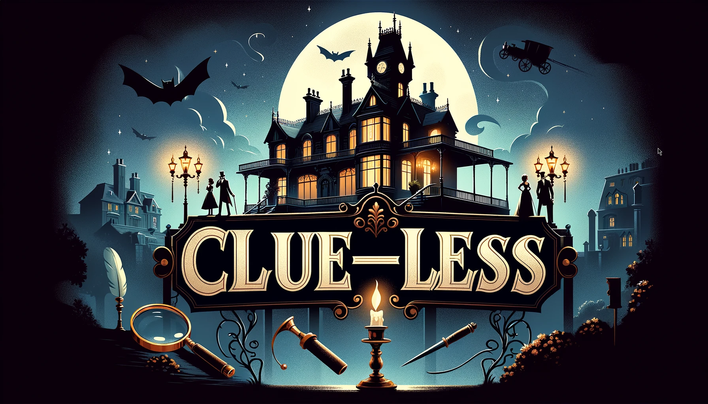

[](https://github.com/mattgermano/clueless/actions/workflows/ci.yml)
[](./LICENSE)
===

## Clue-Less Homepage

<p align="center">
	<strong>✨&#xFE0F; The production game website can be found <a href="https://clueless.cassini.dev/">here</a>. ✨&#xFE0F;</strong>
</p>

## Overview

Clue-Less is a browser-based and simplified version of the popular board game
Clue®.

## Prerequisites

1. [Docker](https://docs.docker.com/get-docker/)
2. [Docker Compose](https://docs.docker.com/compose/install/)

## Getting Started

```bash
./clueless.sh start
```

## Contributors

- **[@JacquelineChew](https://github.com/JacquelineChew)**
- **[@jsuresh830](https://github.com/jsuresh830)**
- **[@bxchaney](https://github.com/bxchaney)**
- **[@mattgermano](https://github.com/mattgermano)**

## License

Clue-Less is licensed under the terms of the MIT license - see [LICENSE](./LICENSE).
